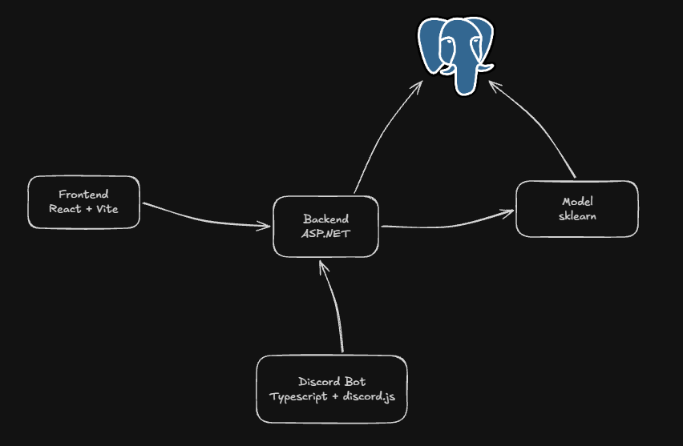

# Architecture

`ARCHITECTURE.md` defines service boundaries and ownership across `model`, `backend`, `frontend`, and bot clients.

## Services

### `model`

Internal Python service around the toxicity model.

Responsibilities:

- load local model artifacts
- run single and batch inference
- own internal model lifecycle operations
- own training and retraining pipelines

Out of scope:

- public product API
- browser auth
- bot auth
- user-facing business logic
- voting and feedback workflows
- frontend-facing analytics

### `backend`

Public product backend.

Responsibilities:

- expose the public HTTP API
- own orchestration, authorization, and product logic
- call the internal `model` service
- own auth, session management, and service authentication
- own voting, feedback, and analyzed-text product semantics
- persist product data in PostgreSQL

### `frontend`

Browser client for the public backend API.

Responsibilities:

- call `backend`
- render user-facing product flows
- handle browser-side interaction and presentation logic

Out of scope:

- direct calls to `model`
- ownership of auth rules
- ownership of voting or feedback data
- product logic that belongs in `backend`

### Bots and external clients

Bots and other external clients use the public `backend` API.

They do not call `model` directly.

## API boundary

- `backend` is the public API boundary for browser clients, bots, and other external consumers.
- `model` is an internal service used by `backend`.
- `frontend` and bots communicate with `backend`, not with `model`.

## Ownership

### Auth

- `backend` owns authentication and authorization.
- Browser auth, session handling, CSRF behavior, and service-client auth belong to `backend`.
- `frontend` consumes auth flows exposed by `backend`.
- `model` does not own public auth behavior.

### Voting and feedback

- `backend` owns voteable text entities, voting flows, actor permissions, and feedback events.
- Voteable text origins are part of the backend domain model. Implemented categories are `random_pool`, `self_submitted`, and `bot_submitted`.
- `frontend` and bots act as clients of those backend-owned flows.
- Voting and feedback are product concerns and do not belong in `model`.

### Training data and model lifecycle

- `model` owns training, retraining, and model-specific runtime behavior.
- Model weights and artifacts belong to `model`.
- `backend` may persist product data that can later be used in training workflows, but it does not own model training logic.

## Data boundaries

- Model weights stay in local artifacts under `model/`.
- PostgreSQL is the shared store for training texts, curated candidates, feedback-derived data, model registry metadata, and retrain jobs.
- PostgreSQL is not the storage for binary model weights.
- Product feedback data remains in backend-owned tables and contracts even when it is later used by model retraining workflows.
- Backend-persisted analyzed texts are product data, not a transfer of product ownership into `model`.

## Deployment boundary

- The system supports both same-origin and cross-origin frontend deployment.
- Same-origin is the simplest local and small-server deployment model.
- Cross-origin support is a backend concern through explicit CORS configuration and stable session/CSRF behavior.
- Frontend deployment decisions must not move product logic or auth decisions into `model`.
